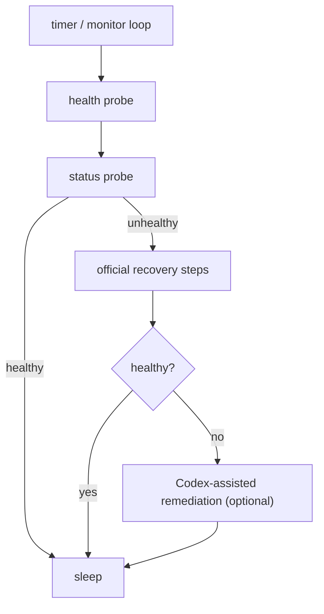

# 🦀 fix-my-claw

[中文](README_ZH.md)

[](LICENSE)
[](#requirements)

A plug-and-play watchdog for OpenClaw — keep it healthy automatically.

## ✨ Highlights

- 🩹 **Auto-heal**: detects unhealthy states and runs recovery steps automatically.
- 🧾 **Operator-friendly**: writes a timestamped incident folder under `~/.fix-my-claw/attempts/` for debugging.
- 🧯 **Safe defaults**: repair cooldown + daily attempt limits + single-instance lock to avoid flapping.
- 🧷 **Service-ready**: ships with systemd units for servers.

- One command to start: `fix-my-claw up`
- Probes `openclaw gateway health --json` + `openclaw gateway status --json`
- Recovers using your official steps (defaults included)
- Optional: Codex-assisted remediation for stubborn cases (off by default, restricted by default)

## 🚀 Quick start (copy/paste)

```bash
python -m venv .venv
source .venv/bin/activate
pip install .

fix-my-claw up
```

Default paths:

- Config: `~/.fix-my-claw/config.toml` (auto-created by `fix-my-claw up`)
- Logs: `~/.fix-my-claw/fix-my-claw.log`
- Attempts: `~/.fix-my-claw/attempts/<timestamp>/`

## ✅ Requirements

- Python 3.9+
- OpenClaw installed and available as `openclaw` in `PATH`

## 🧰 Commands

```bash
fix-my-claw up      # init (if needed) + monitor
fix-my-claw check   # one-time probe
fix-my-claw repair  # one-time recovery attempt
fix-my-claw monitor # long-running loop (requires config)
fix-my-claw init    # write default config
```

## 🧭 How it works (high-level)



## ⚙️ Configuration

All settings live in a single TOML file.

- Default: `~/.fix-my-claw/config.toml`
- Example: `examples/fix-my-claw.toml`

Tip: if `openclaw` isn’t on `PATH` under systemd, set `[openclaw].command` to an absolute path.

## 🖥️ Run it on a server (systemd)

Two options in `deploy/systemd/`:

- **Option A (recommended)**: `fix-my-claw.service` runs a long-lived monitor loop.
- **Option B**: `fix-my-claw-oneshot.service` + `fix-my-claw.timer` runs `fix-my-claw repair` periodically (cron-style).

Example (Option A):

```bash
sudo mkdir -p /etc/fix-my-claw
sudo cp examples/fix-my-claw.toml /etc/fix-my-claw/config.toml

sudo cp deploy/systemd/fix-my-claw.service /etc/systemd/system/
sudo systemctl daemon-reload
sudo systemctl enable --now fix-my-claw.service
```

## 🧩 Codex-assisted remediation (optional)

When enabled, `fix-my-claw` runs Codex CLI non-interactively.

- Default config uses `codex exec` with `approval_policy="never"`.
- Stage 1 is restricted to OpenClaw config/state + workspace + fix-my-claw state directory.
- Stage 2 is disabled by default (`ai.allow_code_changes=false`).

## 🩺 Troubleshooting

- `command not found: openclaw`
  - Ensure OpenClaw is installed and `openclaw` is on `PATH` (especially under systemd).
  - Or set `[openclaw].command` to an absolute path.
- `another fix-my-claw instance is running`
  - A lock file in `[monitor].state_dir` prevents concurrent repairs.
  - If you believe it’s stale, confirm no instance is running, then remove the lock file.

## 🤝 Contributing

See `CONTRIBUTING.md`, `CODE_OF_CONDUCT.md`, and `SECURITY.md`.

## 📄 License

MIT, see `LICENSE`.
