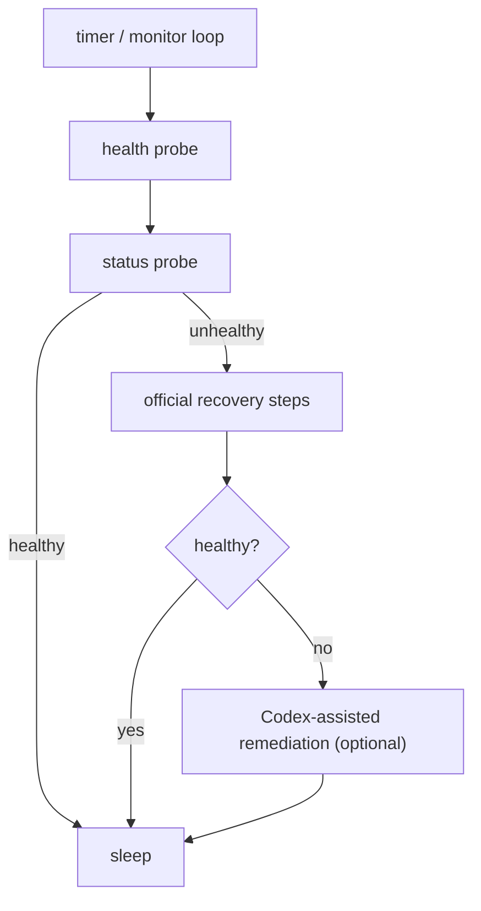

# fix-my-claw

[中文](README_ZH.md)

[](LICENSE)
[](#requirements)

24/7 watchdog + automated recovery for OpenClaw.

## What it does

- **Continuous health checks**: probes `openclaw gateway health --json` and `openclaw gateway status --json`.
- **Official recovery first**: runs your configured “official” steps (defaults to `openclaw doctor --repair` then `openclaw gateway restart`).
- **Optional Codex-assisted remediation**: if official steps still fail, runs Codex CLI non-interactively to apply safe, minimal fixes.
  - By default it is restricted to only write **OpenClaw config/state dir** and **workspace dir**.
  - Only if you explicitly set `ai.allow_code_changes=true`, it can enter a second stage with broader permissions.

## Requirements

- Python 3.9+
- OpenClaw installed and available as `openclaw` in `PATH`

## Quick start

### 1) Install

```bash
python -m venv .venv
source .venv/bin/activate
pip install .
```

### 2) One-command start (recommended)

```bash
fix-my-claw up
```

Default config path: `~/.fix-my-claw/config.toml`.

### 3) Configure

```bash
mkdir -p ~/.fix-my-claw
cp examples/fix-my-claw.toml ~/.fix-my-claw/config.toml
```

### 4) Run

```bash
fix-my-claw check
fix-my-claw repair
fix-my-claw monitor
```

## How it works



## Configuration

All settings live in a single TOML file (default: `~/.fix-my-claw/config.toml`).

- `fix-my-claw init` writes a default config (use `--force` to overwrite).
- `fix-my-claw up` writes the default config if it doesn’t exist, then starts `monitor`.

Key sections:

- `[monitor]`: interval, timeouts, log file, state directory
- `[openclaw]`: `openclaw` command path and probe arguments
- `[repair]`: official recovery steps and step timeout
- `[ai]`: Codex CLI command/args and safety limits (optional)

See `examples/fix-my-claw.toml` for a complete example.

## Running as a service (systemd)

Copy files from `deploy/systemd/`:

- Option A (recommended): `fix-my-claw.service` runs a long-lived monitor loop.
- Option B: `fix-my-claw-oneshot.service` + `fix-my-claw.timer` runs `fix-my-claw repair` periodically (cron-style).

Example (Option A):

```bash
sudo mkdir -p /etc/fix-my-claw
sudo cp examples/fix-my-claw.toml /etc/fix-my-claw/config.toml

sudo cp deploy/systemd/fix-my-claw.service /etc/systemd/system/
sudo systemctl daemon-reload
sudo systemctl enable --now fix-my-claw.service
```

## Codex-assisted remediation (optional)

### Codex CLI

The default config uses `codex exec` with `approval_policy="never"` so it never prompts for confirmation.

Stage 1 uses `-s workspace-write` and `--add-dir` to restrict write access to:

- `openclaw.workspace_dir`
- `openclaw.state_dir`
- `monitor.state_dir`

Stage 2 (disabled by default) is controlled by `ai.allow_code_changes`. Keep it off unless you fully understand the blast radius.

## Files & logs

- Log file: `~/.fix-my-claw/fix-my-claw.log` (configurable)
- State: `~/.fix-my-claw/state.json` (cooldowns/attempt counters)
- Attempt artifacts: `~/.fix-my-claw/attempts/<timestamp>/` (probe outputs + recovery outputs)

## Troubleshooting

- `command not found: openclaw`
  - Ensure OpenClaw is installed and `openclaw` is on `PATH` (especially under systemd).
  - Alternatively set `[openclaw].command` to an absolute path.
- `another fix-my-claw instance is running`
  - `fix-my-claw` uses a lock file under `[monitor].state_dir` to avoid concurrent repairs.
  - If the process crashed, remove the lock file only after confirming no instance is running.
- `permission denied`
  - Run `fix-my-claw` under the same user as OpenClaw, and ensure it can write to `[monitor].state_dir`.

## Contributing

See `CONTRIBUTING.md`, `CODE_OF_CONDUCT.md`, and `SECURITY.md`.

## License

MIT, see `LICENSE`.
