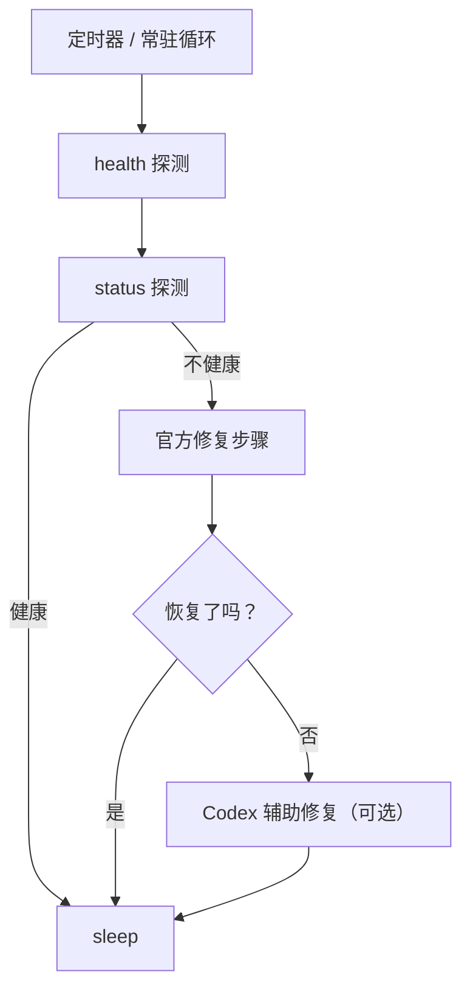

# fix-my-claw

[English](README.md)

[](LICENSE)
[](#前置条件)

面向 OpenClaw 的 7×24 守护与自动恢复工具。

## 功能概览

- **持续健康探测**：周期性执行 `openclaw gateway health --json` 与 `openclaw gateway status --json`。
- **官方修复优先**：不健康时优先跑你配置的“官方修复步骤”（默认：`openclaw doctor --repair` + `openclaw gateway restart`）。
- **可选：Codex 辅助修复**：官方步骤仍失败时，可用 Codex CLI 在全程无确认模式下做最小化修复。
  - 默认只允许写 **OpenClaw 配置/状态目录** 与 **workspace 目录**。
  - 只有当你显式开启 `ai.allow_code_changes=true` 才会进入第二阶段（权限更大）。

> 安全提示：Codex 辅助修复等价于“无人值守地执行命令并修改文件”。建议在受控账号/受限权限/有备份的环境中启用。

## 前置条件

- Python 3.9+
- 已安装 OpenClaw，且 `openclaw` 可在 `PATH` 中直接调用

## 快速开始

### 1) 安装

```bash
python -m venv .venv
source .venv/bin/activate
pip install .
```

### 2) 一键启动（推荐）

```bash
fix-my-claw up
```

会在 `~/.fix-my-claw/config.toml` 不存在时自动生成默认配置，然后启动常驻监控循环。

### 3) 配置（可选）

复制示例配置并按需修改：

```bash
mkdir -p ~/.fix-my-claw
cp examples/fix-my-claw.toml ~/.fix-my-claw/config.toml
```

### 4) 单次检查 / 修复 / 监控

```bash
fix-my-claw check
fix-my-claw repair
fix-my-claw monitor
```

## 工作原理



## 配置说明

所有设置都在一个 TOML 文件里（默认：`~/.fix-my-claw/config.toml`）。

- `fix-my-claw init`：生成默认配置（`--force` 可覆盖）。
- `fix-my-claw up`：若默认配置不存在则生成，然后启动 `monitor`。

常用配置段：

- `[monitor]`：探测间隔、超时、日志文件、state 目录
- `[openclaw]`：`openclaw` 命令路径与探测参数
- `[repair]`：官方修复步骤与单步超时
- `[ai]`：Codex CLI 命令/参数与安全限制（可选）

完整示例见 `examples/fix-my-claw.toml`。

## systemd（推荐）

将 `deploy/systemd/*` 拷贝到你的服务器：

- 方式 A：`fix-my-claw.service`（长驻进程）：每隔 `interval_seconds` 探测并自愈
- 方式 B：`fix-my-claw-oneshot.service` + `fix-my-claw.timer`（cron 风格）：定时跑一次 `fix-my-claw repair`

示例（方式 A）：

```bash
sudo mkdir -p /etc/fix-my-claw
sudo cp examples/fix-my-claw.toml /etc/fix-my-claw/config.toml

sudo cp deploy/systemd/fix-my-claw.service /etc/systemd/system/
sudo systemctl daemon-reload
sudo systemctl enable --now fix-my-claw.service
```

## Codex 辅助修复（可选）

### Codex CLI

默认配置使用 `codex exec`，并通过 `-c approval_policy="never"` 来确保无确认提示。

同时在第一阶段使用 `-s workspace-write`，配合 `--add-dir` 仅允许写：

- `openclaw.workspace_dir`
- `openclaw.state_dir`
- `monitor.state_dir`

第二阶段（默认关闭）由 `ai.allow_code_changes` 控制。除非明确理解影响范围，否则建议保持关闭。

## 文件与日志

- 日志：`~/.fix-my-claw/fix-my-claw.log`（可配置）
- state：`~/.fix-my-claw/state.json`（冷却/次数等）
- 产物：`~/.fix-my-claw/attempts/<timestamp>/`（探测输出 + 修复输出）

## 常见问题

- 提示 `command not found: openclaw`
  - 确保已安装 OpenClaw，且 `openclaw` 在 `PATH` 中（systemd 环境下尤其常见）。
  - 或在配置中将 `[openclaw].command` 设置为绝对路径。
- 提示 `another fix-my-claw instance is running`
  - `fix-my-claw` 会在 `[monitor].state_dir` 下使用 lock 文件避免并发修复互相干扰。
  - 如进程异常退出导致 lock 残留，请先确认没有实例在运行，再手动删除 lock 文件。
- 权限不足（permission denied）
  - 建议与 OpenClaw 使用同一用户运行，并确保对 `[monitor].state_dir` 有写权限。

## 参与贡献

见 `CONTRIBUTING.md`、`CODE_OF_CONDUCT.md` 与 `SECURITY.md`。

## 目录结构（默认）

- `~/.fix-my-claw/`：本工具的 state、日志、修复尝试产物
- `~/.openclaw/`：OpenClaw 的配置与数据目录（可配置）
- `~/.openclaw/workspace/`：OpenClaw workspace（可配置）

## 开源协议

MIT License，见 `LICENSE`。
