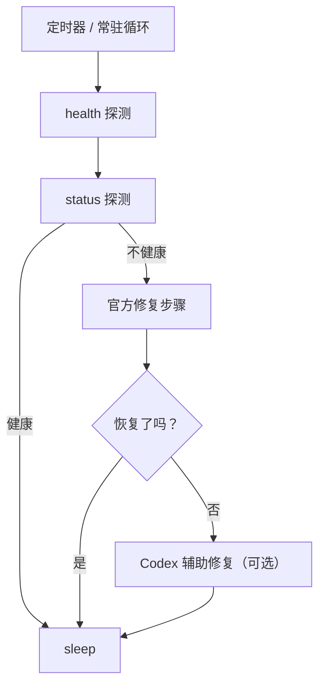

# 🦀 fix-my-claw

[English](README.md)

[](LICENSE)
[](#前置条件)

一个开箱即用的 OpenClaw 守护与自动恢复工具，让服务自己保持健康。

复制这段指令给你的openclaw来启用fix-my-claw：

```安装https://github.com/caopulan/fix-my-claw，使用nohup执行fix-my-claw up```

## ✨ 效果与亮点

- 🩹 **自动自愈**：检测到异常后自动执行修复步骤。
- 🧾 **好排障**：每次异常会在 `~/.fix-my-claw/attempts/` 下保存带时间戳的现场产物。
- 🧯 **默认更稳**：修复冷却、每日次数限制、单实例锁，避免反复抖动。
- 🧷 **上服务器就能用**：内置 systemd 部署文件。

- 一键启动：`fix-my-claw up`
- 定时探测：`openclaw gateway health --json` + `openclaw gateway status --json`
- 优先使用官方修复步骤（默认已内置）
- 可选：Codex 辅助修复（默认关闭，且默认只允许改配置/workspace）

## 🚀 快速开始

```bash
python -m venv .venv
source .venv/bin/activate
pip install .

fix-my-claw up
```

默认路径：

- 配置：`~/.fix-my-claw/config.toml`（`fix-my-claw up` 会自动生成）
- 日志：`~/.fix-my-claw/fix-my-claw.log`
- 产物：`~/.fix-my-claw/attempts/<timestamp>/`

## ✅ 前置条件

- Python 3.9+
- 已安装 OpenClaw，并且 `openclaw` 可在 `PATH` 中直接调用

## 🧰 常用命令

```bash
fix-my-claw up      # 自动生成默认配置（如不存在）+ 启动常驻监控
fix-my-claw check   # 单次探测
fix-my-claw repair  # 单次修复尝试
fix-my-claw monitor # 常驻循环（要求配置已存在）
fix-my-claw init    # 生成默认配置
```

## 🧭 工作原理（概览）



## ⚙️ 配置

所有设置都在一个 TOML 文件里：

- 默认：`~/.fix-my-claw/config.toml`
- 示例：`examples/fix-my-claw.toml`

提示：如果 systemd 环境下找不到 `openclaw`，请把 `[openclaw].command` 配成绝对路径。

## 🖥️ 服务器部署（systemd）

`deploy/systemd/` 提供两种方式：

- **方式 A（推荐）**：`fix-my-claw.service` 常驻监控
- **方式 B**：`fix-my-claw-oneshot.service` + `fix-my-claw.timer` 定时执行 `fix-my-claw repair`

示例（方式 A）：

```bash
sudo mkdir -p /etc/fix-my-claw
sudo cp examples/fix-my-claw.toml /etc/fix-my-claw/config.toml

sudo cp deploy/systemd/fix-my-claw.service /etc/systemd/system/
sudo systemctl daemon-reload
sudo systemctl enable --now fix-my-claw.service
```

## 🧩 Codex 辅助修复（可选）

开启后会使用 Codex CLI 全程无确认执行。

- 默认配置使用 `codex exec` + `approval_policy="never"`
- 第一阶段默认仅允许写：OpenClaw 配置/状态目录、workspace、以及 fix-my-claw 自己的 state 目录
- 第二阶段默认关闭（`ai.allow_code_changes=false`）

## 🩺 常见问题

- 提示 `command not found: openclaw`
  - 确保已安装 OpenClaw，且 `openclaw` 在 `PATH` 中（systemd 环境下尤其常见）。
  - 或将 `[openclaw].command` 配成绝对路径。
- 提示 `another fix-my-claw instance is running`
  - 通过 `[monitor].state_dir` 下的 lock 文件避免并发修复互相影响。
  - 如怀疑 lock 残留，请先确认没有实例运行，再删除 lock 文件。

## 🤝 参与贡献

见 `CONTRIBUTING.md`、`CODE_OF_CONDUCT.md` 与 `SECURITY.md`。

## 📄 开源协议

MIT License，见 `LICENSE`。
